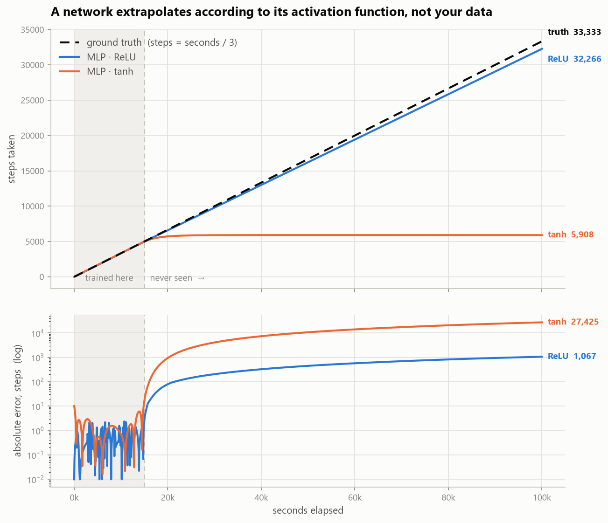

# Extrapolation: Where "Universal Function Approximator" Stops

*08/14/2026*

---

## 1. The Question

I have been carrying around the idea that neural networks are universal function approximators, so in principle they can learn anything. This experiment is a check on that belief. The governing question of this repo is whether the signal is in the input — here the signal is in the input, completely and perfectly, and the network still fails. So the question becomes a different one: **does the network's architecture have the right shape to carry the function past the edge of the data?**

The theorem people quote actually says a wide enough network can approximate any continuous function to arbitrary accuracy **on a compact set**, meaning a bounded interval you name in advance. That clause is the whole experiment. Extrapolation is not a case the theorem handles badly, it is outside of what the theorem ever claimed.

## 2. The Target

The simplest function I could think of that has no noise, no ambiguity, and one obvious rule: I take one step every 3 seconds, so `steps = seconds / 3`. A straight line through the origin.

This matters because it removes every excuse. There is no noise floor, no hidden variable, no regime change, nothing to argue about. If a model gets this wrong, the failure is entirely the model's.

## 3. The Data

Generated, not downloaded. 5,000 training points sampled uniformly from 0 to 15,000 seconds, which is 0 to 5,000 steps. Then three evaluation sets:

- **Interpolation control** — 1,000 fresh points sampled from inside 0 to 15,000. These are the sanity check. If a model fails here, it is broken and the rest of the experiment means nothing.
- **Near extrapolation** — 2,500 points from 15,000 to 22,500 seconds, so 1.5x past the edge.
- **Far extrapolation** — 30,000, 50,000, and 100,000 seconds, so up to 6.7x past the edge.

The interpolation control is the piece I almost left out and it turned out to be the most important part. Without it I could only say "the model failed." With it I can say the model failed *only outside the training range*, which is a completely different claim.

## 4. The Three Models

**Least squares** fits `y = wx + b` by solving directly, no training loop. Two parameters. This is the dumb baseline, the equivalent of GARCH in the volatility project — the classical method that the neural nets have to beat.

**MLP with ReLU** takes 1 input through two hidden layers of 64 units into a linear output. 4,353 parameters. Adam at lr 0.01 for 2,000 epochs.

**MLP with tanh** is the identical network with one word changed. Same width, same depth, same seed, same optimizer, same epochs. The only difference in the entire file is `nn.ReLU` becoming `nn.Tanh`.

That last point is the design of the experiment. If two models that differ by one token behave completely differently outside the data, the cause has to be the activation function and nothing else.

## 5. Keeping It Honest (Methodology)

Unlike the volatility project there is no leakage risk here, since the data is generated and there is no time axis to contaminate. But there is a different trap I had to avoid: **normalization**.

Inputs and targets are standardized using the **training** mean and standard deviation only, and that same fixed transform is applied to every evaluation point. If I had refit the scaler on the far points, 100,000 seconds would have been silently mapped back into the range the model already knew, and the whole thing would have looked like it worked. That is the one mistake that would have quietly invalidated the result.

Both networks trained to a loss of roughly zero. That is deliberate and it is what makes the result mean something — this is not a story about undertraining.

## 6. Results

MAE is in steps, lower is better. Truth at 100,000 seconds is 33,333 steps.

| Model | Interpolation (0–15k) | Near extrap (15k–22.5k) | 30,000s | 100,000s |
|---|---|---|---|---|
| Least squares | 0.00 | 0.00 | **10,000** (exact) | **33,333** (exact) |
| MLP · ReLU | 0.60 | 57.8 | 9,795 (off 206) | 32,266 (off 1,068) |
| MLP · tanh | 1.66 | 688 | 5,895 (off 4,105) | 5,908 (off 27,425) |

A 2-parameter model with no training loop beats a 4,353-parameter network by an unbounded margin, and the margin keeps growing the further out you ask.



## 7. What It Means

Both networks learned the function. The interpolation column proves it — inside the training range they are accurate to within a step or two out of 5,000. Nothing is underfit, nothing is undertrained. And they still cannot tell me where I am at 30,000 seconds.

The reason is that a ReLU network is exactly a piecewise-linear function, where every ReLU unit contributes one kink and training puts all of those kinks where the data is. Past the last kink no unit ever changes state again, so the network stops being a network and collapses into a single fixed straight line running forever. I can prove that happened from my own three far predictions:

```
slope implied by the two ends:  (32,265.8 − 9,794.5) / (100,000 − 30,000) = 0.32102
that line evaluated at 50,000:  0.32102 × 50,000 + 164 = 16,215
what the model actually said:                             16,215.5
```

Three points, perfectly collinear. It is `y = 0.321x + 164` out there, and the true slope is 0.3333, so it is 3.7% short forever and the error grows without bound.

tanh does something different and worse. tanh saturates, so once every unit is pinned at ±1 nothing downstream can move. Look at its three far predictions: 5,895, then 5,914, then 5,908. Not increasing, not even monotonic — that is noise around a constant. I asked it about 30,000 seconds and about 100,000 seconds and it gave me the same answer.

So the conclusion is this: **a network's behavior outside its training range is determined by its activation function's asymptote, not by any pattern in the data.** ReLU runs straight forever, tanh goes flat forever. Neither one learned "one step every three seconds." ReLU only looked competent because a straight line happened to be the correct shape by coincidence, and even then it got the slope wrong.

The least squares model wins infinitely, and not because it is smarter. It wins because its inductive bias — the shape it is capable of representing — *is* the true function's shape. Extrapolation is not a capacity problem. It is a shape-prior problem. Adding parameters to the MLP would not have helped; it would have added more kinks inside the data and changed nothing at all past the boundary.

## 8. How This Fits The Other Experiments

This is the volatility and primes question rotated 90 degrees.

- **Volatility** — the signal is in the input, and the models find it.
- **Primes** — the information is technically in the input but not in a form the model's inductive bias can use.
- **Extrapolation** — the signal is in the input, perfectly, and the model learns it exactly. Then it is asked one question from outside the box and confidently returns garbage.

The common thread across all three is that a neural network is not a rule learner. It is a surface fitted over the region you showed it. Inside that region it can be extraordinary. One step outside it, it does not degrade gracefully and it does not signal uncertainty — it reports the shape of its own building blocks, with exactly the same confidence it had on the training data.

**The follow-up worth running:** change the target to `x/3 + 50*sin(x/2000)` and rerun. ReLU will still leave the training range in a straight line, now catastrophically wrong. That confirms the straight line was never skill.
