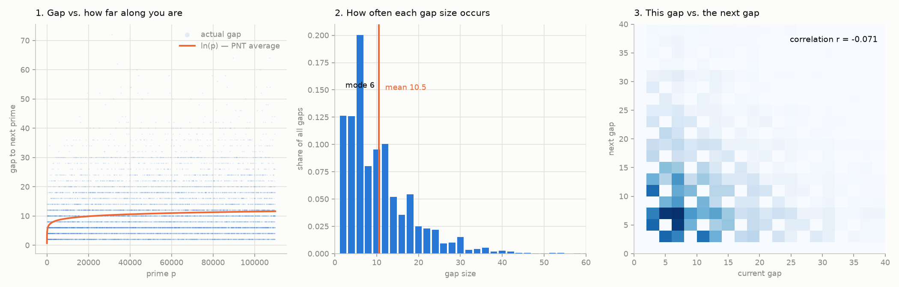

# Predicting Prime Gaps: Baselines vs. Linear vs. MLP vs. Transformer

*08/07/2026*

---

## 1. The Question

This experiment is the counter-example to the volatility project, using prime numbers. What separates volatility from primes is that for prime gaps, the signal is not in the input. I am trying to show the limitations of the universal approximation theorem.

The volatility experiment showed that a neural network only matches a signal that genuinely exists: GARCH, an MLP, and an LSTM all landed on nearly the same RMSE, because volatility clusters, and once a model has that there is nothing left to find. What I wanted to test here was my belief that neural networks are "universal function approximators," which I had been treating as though it meant a big enough network can learn anything. Volatility clusters; primes do not. Whether 31,399 is prime has nothing to do with the primes that came before it.

My hypothesis going in: every model learns the average gap trend from the Prime Number Theorem, none of them ever nails the exact prime, and the transformer does not beat the dumb baseline. Complexity cannot rescue a signal that isn't there.

## 2. The Target

I predict the **gap**, `p(n+1) - p(n)`, rather than the next prime itself.

The reason is that `p(n)` is handed to me in the input. The next prime is `p(n) + gap`, so asking a model to predict the raw prime is asking it to predict something it already almost entirely knows. A "model" that ignores every feature and simply echoes its last input prime explains **99.999983%** of the variance in the next prime. It has learned nothing — it just gets credit for repeating the input back.

Scale makes it worse. That same echo model looks better and better as the numbers grow, purely because the numbers grow:

| prime range | mean absolute error | mean relative error |
|---|---|---|
| 0 – 1,000 | 6.38 | 3.2837% |
| 1,000 – 10,000 | 8.18 | 0.1893% |
| 10,000 – 50,000 | 10.38 | 0.0420% |
| 50,000 – 110,000 | 10.99 | 0.0143% |

The absolute error *grows* while the relative error *shrinks by 230×*. Any percentage metric on the raw prime is measuring the size of the numbers, not the quality of the prediction. Predicting the gap throws away the free credit and leaves only the part nobody knows. It is also bounded — gaps run 2 to 72 instead of 2 to 110,000 — which is a far saner range for a network's output layer.

I left the target unnormalized and untransformed. That keeps RMSE in raw gap units, so every number in the results table is directly comparable to the baselines with nothing to unwind. In volatility I predicted *log* realized volatility, because volatility is positive and right-skewed. Prime gaps are right-skewed too, so the same move was available, and I deliberately skipped it: MSE on a raw target drives a model toward the conditional mean, and "does it just predict the conditional mean?" is precisely the hypothesis. A log transform would have pulled the models toward the conditional median instead, and changed what the experiment measures.

## 3. The Data

Primes below 110,000, generated with a sieve — 10,448 windows at `k = 5`. Each sample is 5 consecutive primes; the target is the gap from the 5th to the 6th. The 6th prime is never inside the window, so the answer always sits one position past the edge of what the model can see.

The labels have **zero noise**. In the volatility project the target was realized volatility, itself an estimate carrying measurement error, so part of the floor every model hit there was noise in the label. Here every label is exactly right and independently verifiable — `nextprime(17977) = 17981`, forever.

We feed the network the 4 gaps derived from the 5 primes, subtracting each by its neighbor, plus the `ln` of the largest prime the gaps were derived from. The gaps carry the local structure; `ln(p)` carries magnitude, which is the Prime Number Theorem trend.

Raw primes are never fed to a network, and working out why turned out to be the most useful practical lesson in the project. Five consecutive primes near 17,950 differ from each other by about 10, while the dataset spans 110,000. Z-score them and all five collapse into five copies of the same number — the within-window differences are roughly 0.01% of the across-window spread, so the gap information, which is the actual subject of the experiment, gets crushed into the noise floor. **Normalization can destroy the signal you are trying to measure.** Splitting the two sources apart by hand — gaps on their own scale, magnitude as a separate `ln(p)` feature — is what avoids it, and it also means nothing is hidden. If the models fail, it is not for lack of information.



**Panel 1** shows the trend is real and tiny. `ln(p)` does track the center of the cloud, but across the entire range the average gap climbs only from about 7 to 11.6, while individual gaps at any point span 2 to 72. The horizontal stripes are gaps being discrete even numbers.

**Panel 2** shows the distribution: right-skewed, mode at **6**, mean at **10.5**. That distance between mode and mean is why my metrics disagree throughout — RMSE pulls a prediction toward 10.5, exact-hit rewards 6. The spikes at 6, 12, and 18 are real number theory rather than noise, since consecutive primes above 3 are constrained mod 6.

**Panel 3** is the one that mattered. Current gap on x, next gap on y. If knowing this gap told you anything about the next, there would be a bright diagonal ridge. There isn't. The bright cross and mild checkerboard are just panel 2's distribution repeated along both axes — which is what a joint density looks like when two variables are **independent**. Lag-1 correlation is **r = -0.071**, so consecutive gaps share about **0.5%** of their variance.

## 4. The Models

| model | what it sees | params |
|---|---|---|
| always 6 | nothing | 0 |
| avg recent gap | the 4 gaps | 0 |
| `ln(p)` — PNT | magnitude only | 0 |
| lookup table | exact 4-gap pattern | memorizes 3,953 patterns |
| linear regression | 4 gaps + `ln(p)` | 6 |
| MLP | 4 gaps + `ln(p)` | 737 |
| transformer | the same 5 values as a 5-token sequence | 8,801 |

**always 6** predicts the most common gap and ignores the input entirely. It is here because a constant turns out to be a brutal baseline on the exact-hit metric.

**avg recent gap** averages the 4 gaps in the window — the obvious naive model, and the one I expected to be respectable.

**ln(p)** is the Prime Number Theorem: the average gap near *p* is about `ln(p)`. One line, no fitting, 130 years old.

**lookup table** groups the training set by exact 4-gap pattern and predicts each group's mean. It is a perfect memorizer with unlimited capacity, included to find out whether there is anything worth memorizing.

**linear regression** is least squares on the 5 features. No normalization needed, no epochs, no learning rate.

**MLP** is the same architecture as the volatility project — two hidden layers, ReLU, linear output — with input dimension 5 instead of 8. Holding the architecture and training procedure fixed across both projects is deliberate: any difference in outcome is then attributable to the data.

**transformer** is my first one, and it is here because it is the architecture everyone reaches for. Each of the 5 features becomes a token: a scalar projected up to 32 dimensions by a learned linear layer, plus a learned positional embedding, because attention is order-blind and would otherwise treat the window as an unordered bag. One encoder layer, mean-pool across tokens, linear head to a single number. The sequence is only 5 tokens long, so attention has almost no distance to cross — which is itself part of the point.

## 5. Keeping It Honest (Methodology)

70% train / 15% validation / 15% test — 7,313 / 1,567 / 1,568.

The split is **random**, not chronological, and that is a deliberate reversal of the volatility project. There, a chronological split was mandatory: predicting Tuesday from Wednesday is lookahead bias and invalidates everything. Here there is no future to leak. Primes are not a time series, they are a fixed mathematical object, and every prime below 110,000 already exists. Testing on a random subset asks whether the model can **interpolate** — fill in a point surrounded by points it has already seen — which is exactly what "universal function approximator" claims. Making it chronological would have tested extrapolation instead, a different and much harder question.

Features and normalization statistics come from the training set only, then get applied to validation and test. `build_features` and `score` live in one shared module so every model sees byte-identical inputs and is measured identically — otherwise I would be comparing architectures and feature sets at the same time and could not attribute the difference.

Test was touched once, after every decision was final. I did not get this right the first time: I initially put the test evaluation *inside* the training loop, printing test RMSE every 50 epochs. That quietly turns test into a second validation set, because the minimum I could see at epoch 300 is not a number I am entitled to report. Epoch counts are chosen from the **validation** curve, which flattens after roughly epoch 150.

Two honest caveats.

**Memorization was made easy, not hard.** A random split means test windows sit adjacent to training windows in magnitude, which is the friendliest possible arrangement for a model that memorizes. It still doesn't help. The lookup table scores 9.113, worse than predicting the mean, because 35.2% of test patterns never appear in training at all and the repeated ones contradict each other. The networks did attempt it — validation loss bottoms around epoch 200–300 and then creeps up while training loss keeps falling — and it made them worse.

**Consecutive windows overlap.** Sample *i* and sample *i+1* share four of their five primes, and the answer to sample *i* appears *inside* the input of sample *i+1*. With a random split those two can land on opposite sides, so train and test are not fully independent. This is worth stating, and it is not exploitable: gradient descent fits labels, and that shared prime appears only as an input, never as a label, so there is no path by which a model could turn it into an advantage. Removing it would mean striding the windows and losing 80% of the data, or purging the boundary — neither worth paying for a dependence with no route to the result.

## 6. Results

| model | params | MAE | RMSE | exact hit | variance explained |
|---|---|---|---|---|---|
| always 6 | 0 | 5.932 | 9.286 | **19.3%** | — |
| avg recent gap | 0 | 6.826 | 9.274 | 10.8% | — |
| lookup table | memorizes all | — | 9.113 | — | — |
| `ln(p)` — PNT | 0 | 5.990 | 8.111 | 10.4% | 1.5% |
| **linear** | **6** | **5.918** | **8.055** | 12.2% | **2.8%** |
| MLP | 737 | 5.940 | 8.071 | 11.0% | 2.4% |
| transformer | 8,801 | 5.960 | 8.077 | 11.4% | 2.3% |

*All figures on the test split. RMSE and MAE are in gap units; lower is better. "Exact hit" is how often the prediction, snapped to the nearest even number, equals the true gap. Predicting the test mean and ignoring the input entirely gives RMSE 8.170.*

Read the RMSE column against the params column:

```
6 params      -> 8.055
737 params    -> 8.071
8,801 params  -> 8.077
```

**The ladder runs backwards.** Every rung of added complexity made it slightly worse. The three are separated by 0.02 gaps, which is a tie in any practical sense, and the tie is the finding: a 1,467× increase in parameters bought nothing. Linear regression is the best model in the project.

The MLP does genuinely beat `ln(p)`, and I checked that it wasn't luck — across 8 random initializations the advantage is 0.045 ± 0.004, reproducible at roughly 11 standard deviations. It is also four hundredths of a gap.

The transformer spent epochs 50–150 on a flat plateau at ~70.3 validation MSE, which is the network having learned the mean and nothing else while attention was still near-uniform. It broke symmetry around epoch 200 and landed on the same solution the MLP had reached by epoch 100.

And **always 6 wins exact-hit outright**, by a factor of 1.6 over every learned model. MSE drags all of them to the conditional mean of 10.5, while the most common gap is 6 — so no model that learned anything ever predicts the single most likely answer. Three architectures, and not one can name the next prime as often as a constant can.

## 7. What It Means

**The scatter plot predicted the neural network.** Panel 3 measured r² ≈ 0.005 of local signal before a single model was trained. The models then landed at 2.3–2.8% explained variance, of which `ln(p)` alone accounts for 1.5%. Everything the four gap features and 8,801 parameters contributed over and above a formula from 1896 is about one percentage point. I did not need to train anything to know how this would go. I needed to look at the lag plot.

Decomposing where that little bit lives:

| | test RMSE |
|---|---|
| raw `ln(p)`, uncalibrated | 8.1110 |
| fitted `a + b·ln(p)` | 8.1104 |
| the 4 gaps **alone** | 8.1509 |
| gaps + `ln(p)`, linear | 8.0548 |

Fitting the Prime Number Theorem's constants buys nothing — it is already optimally calibrated for this range. The 4 gaps alone score *worse than ignoring history entirely*. Only combined with magnitude do they add anything, and the whole of it is linear.

**Two nearly identical inputs have wildly different answers.** This is the mechanism, and it is clearest in one pair from the test set — the two windows whose normalized feature vectors are closest together, the two inputs the network is least able to tell apart:

```
window 1: [31379, 31387, 31391, 31393, 31397]   gaps [8, 4, 2, 4]
window 2: [24091, 24097, 24103, 24107, 24109]   gaps [6, 6, 4, 2]

network predicts:  11.94   and   11.69
truth is:            72    and      4
```

`nextprime(31397) = 31469`, with 71 consecutive composites in between — a first-occurrence maximal gap. What blocks those 71 integers is a scatter of unrelated primes: 31399 = 17 × 1847, 31411 = 101 × 311, 31439 = 149 × 211, 31459 = 163 × 193. To know the answer is 72 you must check 71 integers against all 40 primes below √31469. None of that is in `[8, 4, 2, 4]`, and nothing derived from it could be.

This is not a modeling failure. A function returns one value per input, so if near-identical inputs have answers 18× apart, **no function of that input can be right for both**. Grouping the training set by exact gap pattern makes it concrete: the pattern `(6, 8, 6, 6)` appears 18 separate times with truths ranging from 4 to 30. Across all patterns seen 10 or more times, the spread of answers *within* a single pattern is 7.44 against an overall spread of 8.07 — knowing the exact gap sequence narrows the uncertainty by 8%. That is the ceiling, and it is not a ceiling for my MLP. It is a ceiling for anything.

So the models hedge. Predictions span 5.33 to 13.92 with a standard deviation of 1.44, against truths spanning 2 to 72 with a standard deviation of 8.17. Having found nothing reliable to key on, MSE drives every model to huddle near the mean, which is the mathematically correct response to an input that tells you nothing. None of them ever predicts 72. None of them could.

**The information is there; the structure isn't.** This is the part that changed how I think about the governing question. The next prime is a perfectly deterministic function of `p(n)` — no randomness, one right answer, computable by trial division — and `p(n)` is in the input. Information-theoretically the input determines the target *completely*. The models extracted 2.8%.

Universal approximation guarantees that a wide enough network can approximate any **continuous** function, and both words do work here. Continuity requires nearby inputs to give nearby outputs, and 31,397 and 24,109 are nearby in every coordinate the model has while their answers are 68 apart. Locality is the other problem: deciding whether `p + 2` is prime requires divisibility against every prime up to `√p`, which is global information about the integers that no window of recent primes contains. And approximation is not learning — even if the function were representable, gradient descent still has to find it from 7,313 samples of something with no smoothness to follow.

So the question I have been asking across both projects — *is the signal in the input?* — turns out to be too coarse. Here the signal is not merely present, it is total. What is missing is any structure a function approximator can use. The better question is **whether the signal is in the input in a form the model's inductive bias can exploit**. Gradient descent on MSE searches a space of smooth interpolants. Trial division is a tiny program and a terrible interpolant, and it is not in that space at any width.

**Compared to volatility.** Three very different models tied there because the signal was shallow but real, and all three found it. Three very different models tie here because there is almost nothing to find. The same-looking result, opposite causes — and in this project the floor is not even noise. Every label is exact. The ~97% of variance left unexplained is real, deterministic structure sitting in the integers, entirely out of reach of a model looking at five recent primes.

One honest caveat: r = -0.071 is not zero, and at this sample size it is statistically real. There is a whisper of local structure and it is *negative* — an unusually large gap tends to be followed by a slightly smaller one, which is mostly regression to the mean rather than anything exploitable. "Hypothesized absent" became "measured at r² ≈ 0.005," which is a better sentence than the one I started with.

**What I would test next.** If the argument above is right, the failure is representation rather than capacity, so the same MLP given the right input should succeed. Feeding a network `n mod 2, n mod 3, n mod 5, … n mod 173` instead of recent gaps ought to make primality nearly trivial to learn, since below 178² a number is prime exactly when none of those residues is zero. Same architecture, same optimizer, transformed problem. That would turn the claim into a result.

## 8. Files

| file | what it does |
|---|---|
| [primes_gaps.py](primes_gaps.py) | sieve, windowing, split, shared `build_features` and `score` |
| [plot_gaps.py](plot_gaps.py) | the three-panel figure |
| [baseline.py](baseline.py) | the zero-parameter baselines |
| [linear.py](linear.py) | least squares on the same features |
| [primemlp.py](primemlp.py) | the MLP |
| [primetransformer.py](primetransformer.py) | the transformer |
